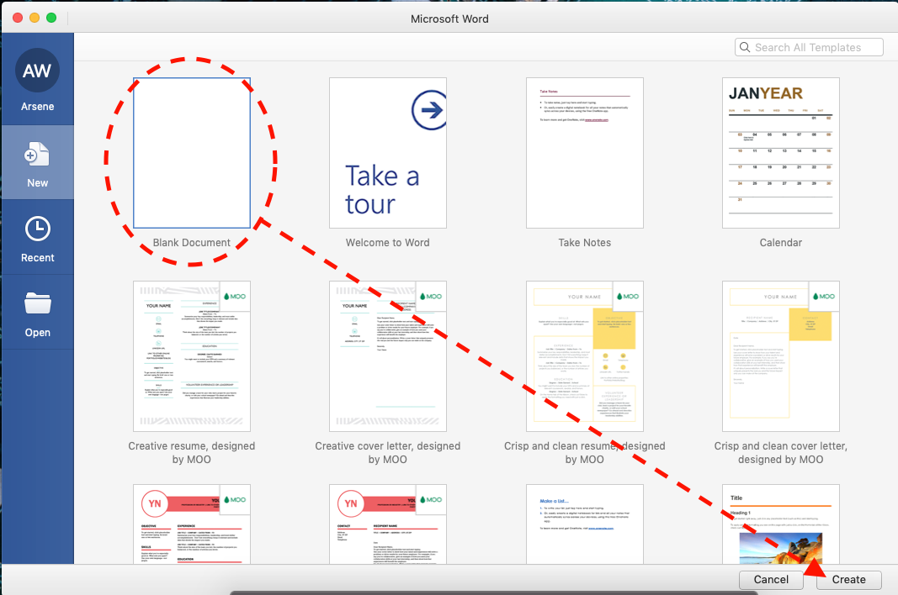
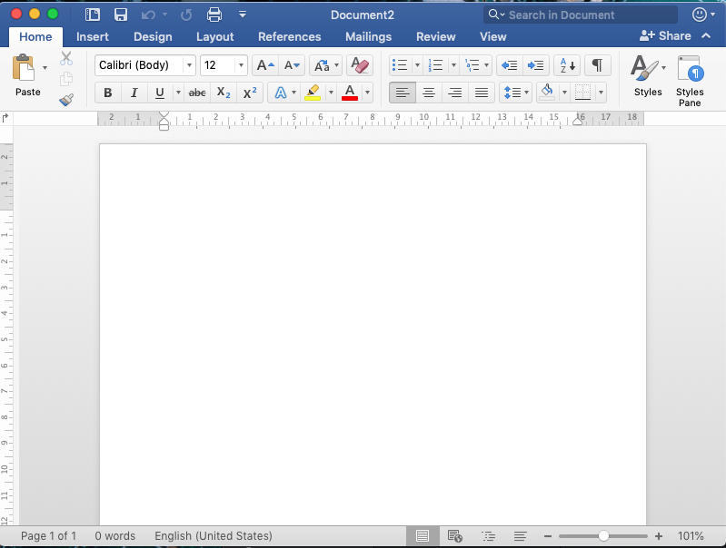
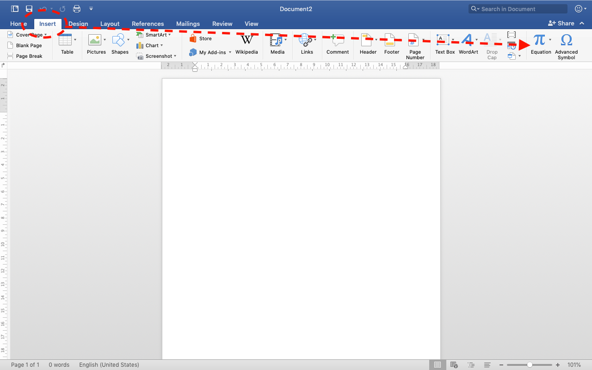
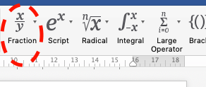
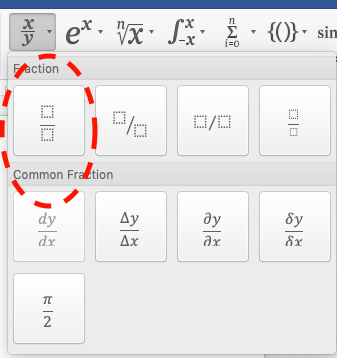
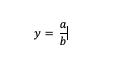
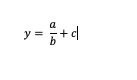

# Langkah Praktik Pembuatan Rumus Sederhana

## Langkah Awal 
1. Buka aplikasi **Microsoft Word**

    

2. Pilih Blank Document, klik create

    

3. Hasil dokumen baru

    

## Buat Rumus
1. Klik Insert, pilih Equation

    

2. Terbuka menu Equation, pilih jenis rumus yang hendak dibuat (contoh: y = (a/b)+c)

    
    **y = (a/b) + c**
    
    

3. Buat model untuk **y =** , ketikkan di bagian Type Equation here

    

4. untuk **(a/b)**, buat komponen tersebut dengan menggunakan jenis rumus Fraction

    

    pilih jenis yang sesuai contoh:

    

    Isikan variabel a dan b sesuai posisi yang tepat

5. untuk **+ c**, tambahkan secara manual

    