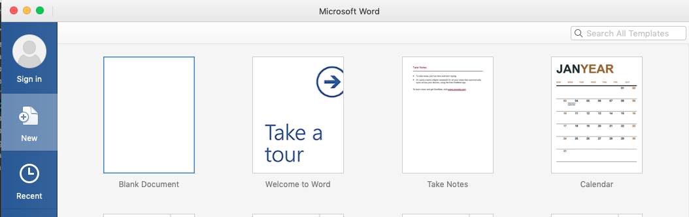
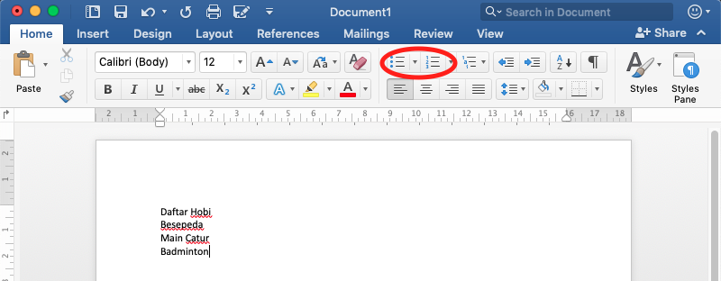
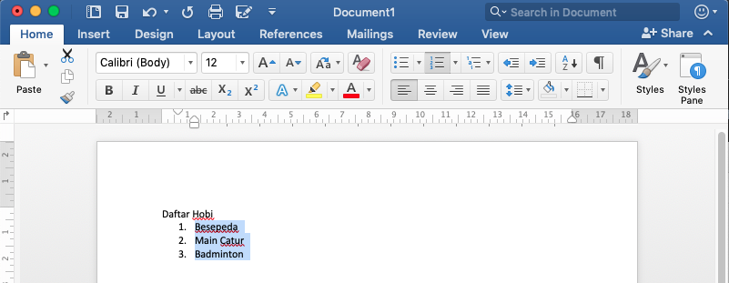

# List
## Pengertian List
List merupakan format penomoran sebuah item di dalam sebuah dokument.
Ada 2 jenis list yang dapat digunakan yaitu
* Ordered List

    Merupakan model penomoran untuk melakukan pengurutan menggunakan
    simbol pengurutan, misalkan `1,2,3`, `I,II,III`, `i,ii,iii`, dan
    lainnya
* Unordered List

    Merupakan model penomoran tanpa melakukan pengurutan, biasanya
    menggunakan simbol-simbol khusus yang sifatnya non-alfanumerik.

## Cara Membuat Ordered List
1. Buka microsoft office seperti tampilan di bawah ini

2. Pilih `Blank Document` - Klik tombol `Create`
3. Buat sebuah daftar seperti pada gambar di bawah ini

4. Pilih daftar yang akan dibuat list, selanjutnya pilih jenis list
   sesuai dengan yang diblok merah
5. Hasilnya dapat dilihat seperti di bawah ini

